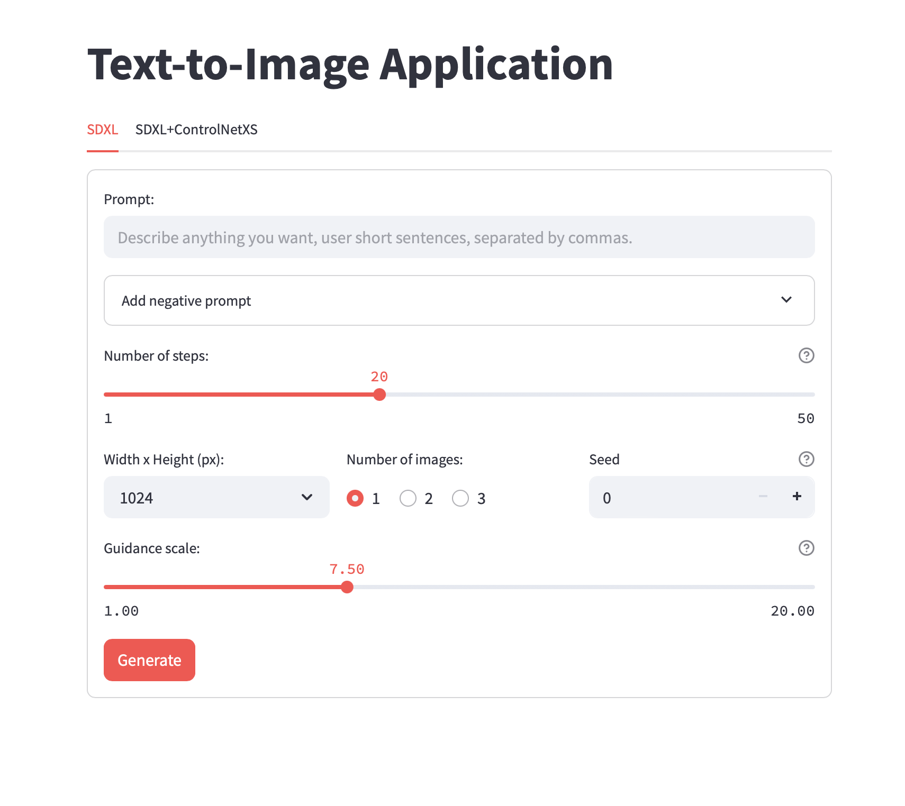
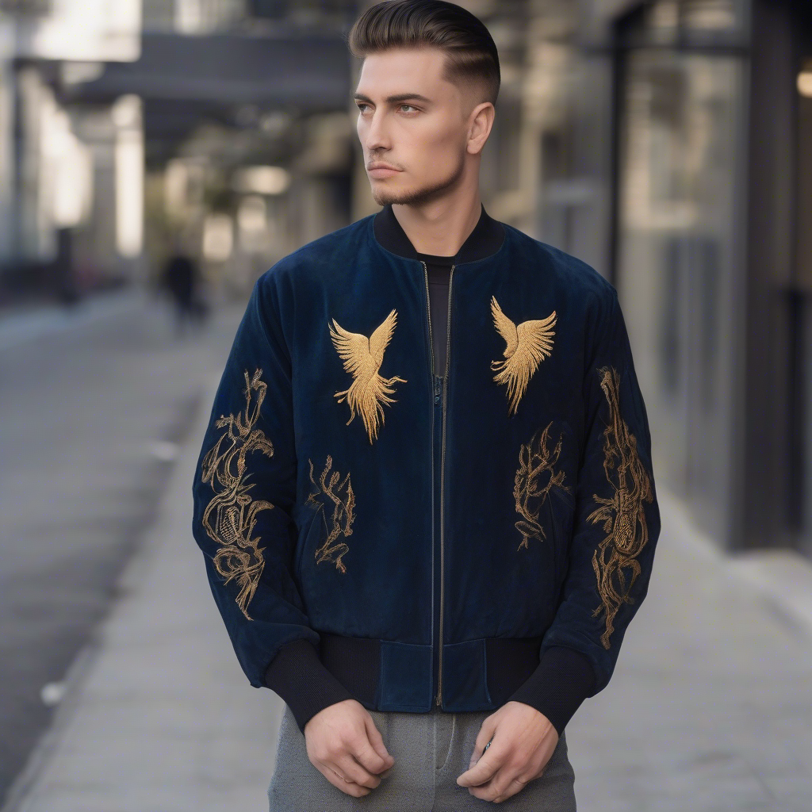
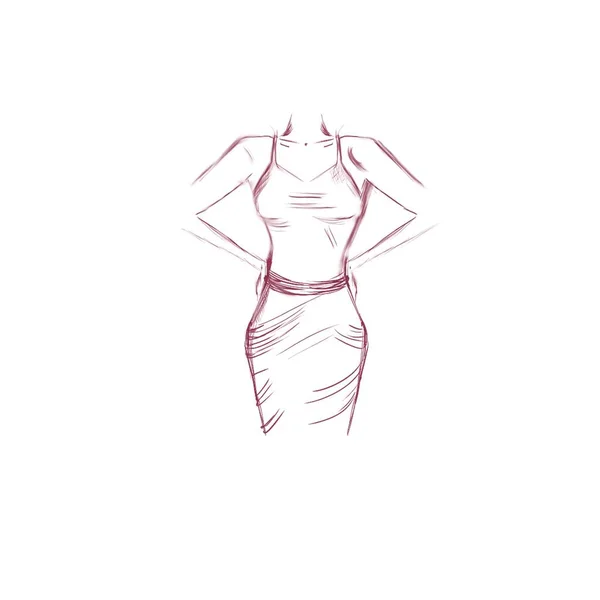
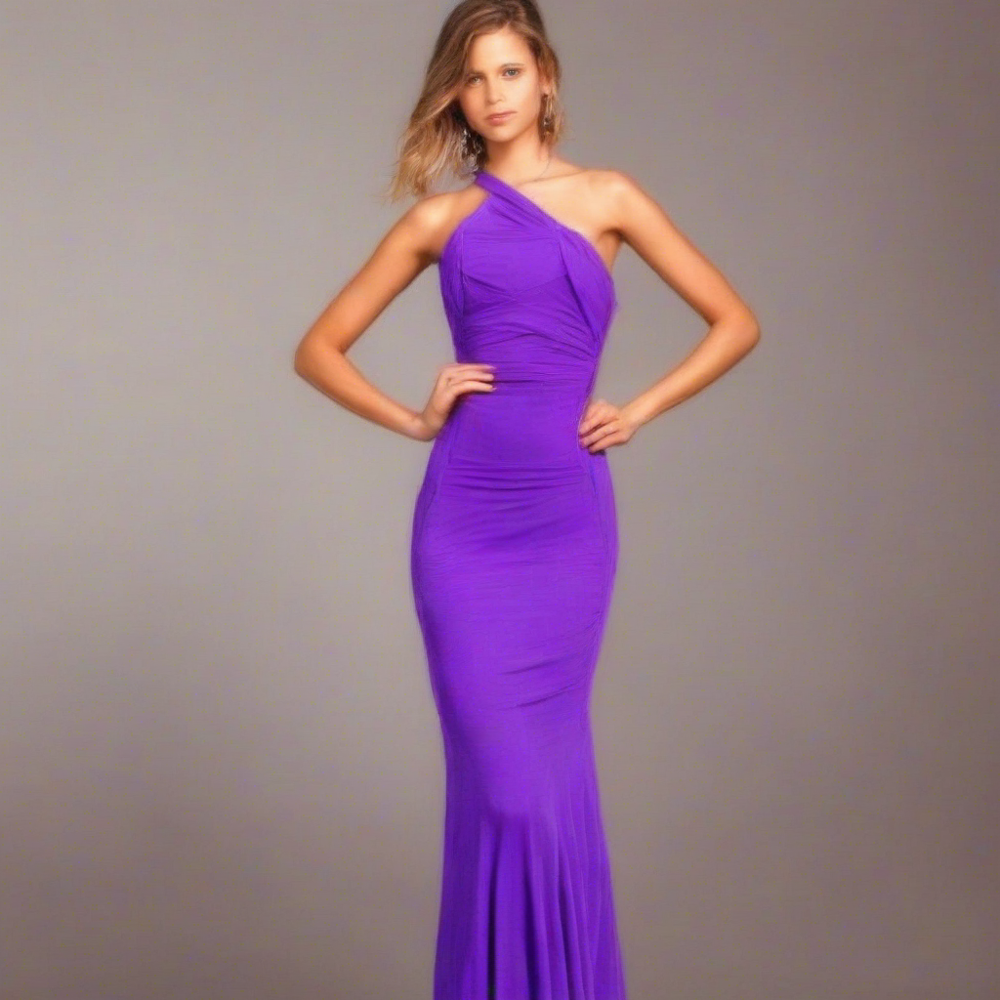

# 🧥 Fine-tune SDXL for Fashion Image Generation

This project focuses on fine-tuning **Stable Diffusion XL (SDXL)** on **fashion-related datasets** using **LoRA** with Hugging Face's `diffusers` library, and deploying a simple **Streamlit app** to demonstrate the results.

---

## 📌 Project Overview

### 🔍 1. Data Collection
- Scraped fashion images and raw captions from various online sources.
- Cleaned and organized the dataset for training.

### 🛠️ 2. Preprocessing
- Resized and formatted images.
- Refined and standardized text prompts using **BLIP-2**.
- Prepared dataset in Hugging Face format (`datasets.Dataset` or similar).

### 🧠 3. Fine-tuning SDXL with LoRA
- Used Hugging Face `diffusers` with **LoRA (Low-Rank Adaptation)** to fine-tune the model.

### 🌐 4. Streamlit App Demo
- A user interface to input text prompts and generate fashion images.
- Demonstrates the capabilities of the fine-tuned SDXL model.
- Supports sketch + text to image generation using pretrained SDXL with ControlNet-XS.
---

## 🚀 How to Run

### 1. Clone the repository
```bash
git clone https://github.com/your-username/fashion-sdxl.git
cd fashion-sdxl
```
### 2. Create environment & install dependencies
```bash
python -m venv venv
source venv/bin/activate  # or `venv\Scripts\activate` on Windows
pip install -r requirements.txt
```
### 3. Launch the demo
```bash
streamlit run src/app.py
```
---

## 🖼️ Demo Showcase
### 🎨 1. Main App Interface

<p align="center">
  
</p>

### 🧥 2. Text-to-Image Output
**Prompt:**

> A unisex bomber jacket made of premium suede material, in navy blue color, featuring an embroidered golden phoenix design on the back, with ribbed cuffs and hem in black knitted fabric; modern style with a touch of  90s retro, captured under professional studio lighting with a softly blurred background.

**Generated Image:**

<p align="center">
  
</p>

### ✏️ 3. Sketch + Text-to-Image (ControlNet-XS)
**Prompt:**

> model with purple dress

**Input sketch:**
<p align="center">
  
</p>


**Generated Image:**
<p align="center">
  
</p>
⚙️ This feature uses pretrained SDXL + ControlNet-XS, without fine-tuning.